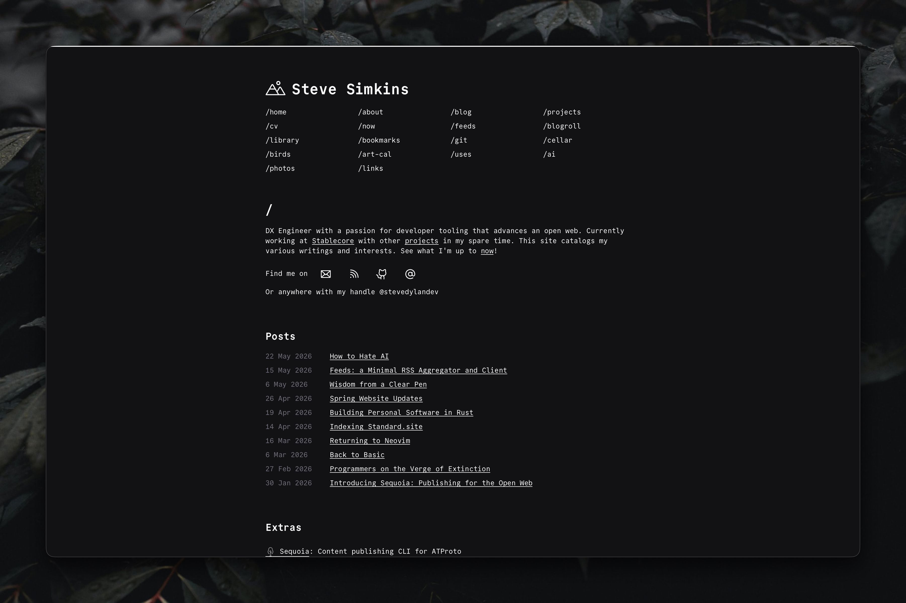
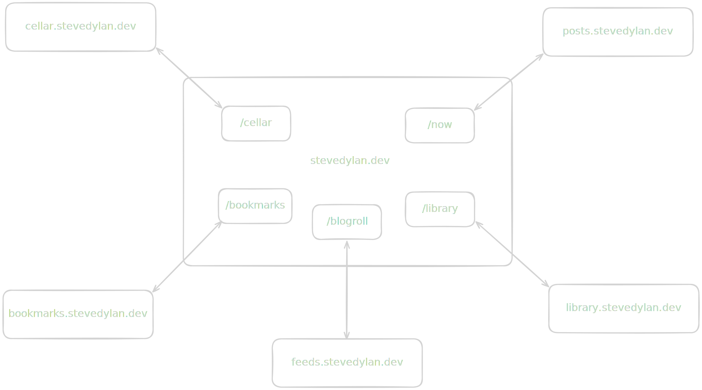

# stevedylan.dev



</br>

My personal website and digital garden for all my writing and interests. Built with [Astro](https://astro.build), originally based on the [Astro Cactus theme](https://astro.build/themes/details/astro-cactus/) but significantly diverged over the years. Most content is `prerendered`, while some pages are server-rendered per request via `export const prerender = false` to pull live data from external services.

### Structure

```
stevedylan.dev/
├── public/             # static assets, icons, fonts
├── scripts/            # build/utility scripts
├── src/
│   ├── assets/         # images used in posts/pages
│   ├── components/     # Astro components
│   ├── content/        # MDX posts and pages (collections)
│   │   ├── pages/
│   │   └── post/
│   ├── data/           # static data sources
│   ├── layouts/        # page layouts
│   ├── pages/          # routes (static + SSR)
│   ├── styles/         # global CSS
│   ├── utils/          # helpers
│   └── site.config.ts  # site-wide config
├── astro.config.mjs
└── wrangler.toml       # Cloudflare config
```

### Dynamic Pages



Dynamic pages fetch from small atomic services I run separately (see [andromeda.build](https://andromeda.build)) rather than bundling everything into one massive app.

## License

[MIT](LICENSE)
