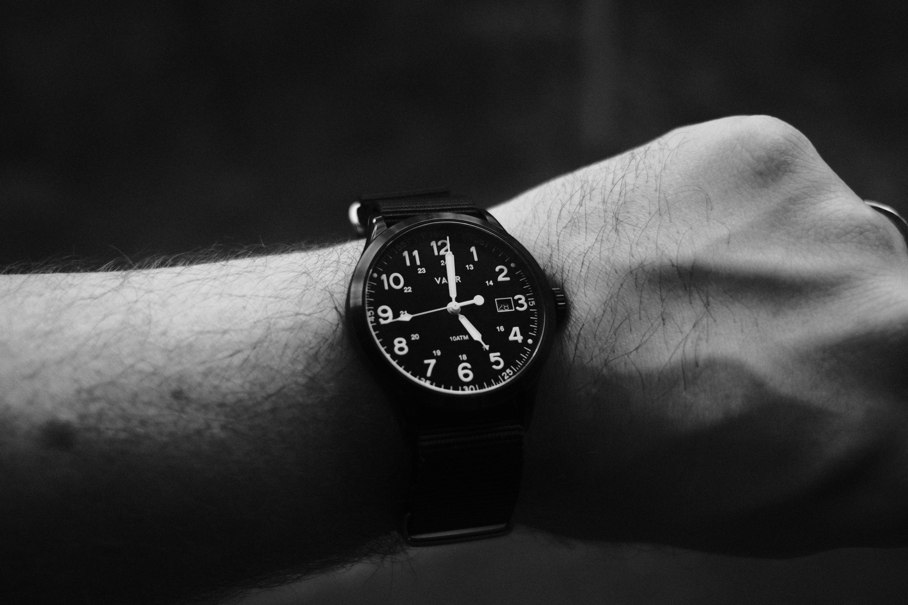
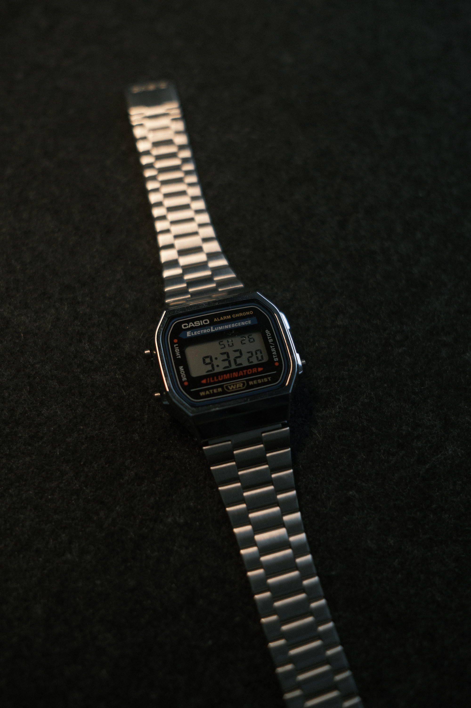
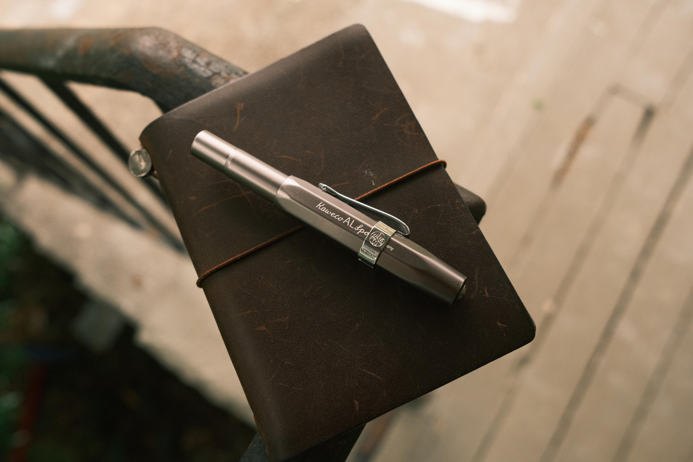
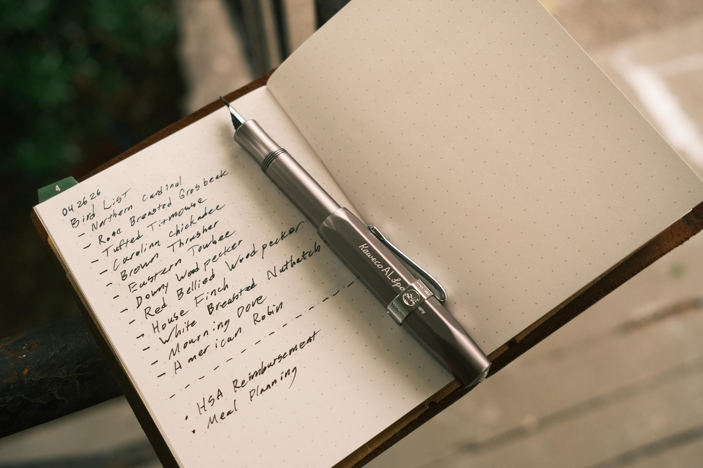

# EDC

I used to be way more into EDC (Everyday Carry) and collected quite a bit of gear, but over the years I've significantly slimmed down. The following list isn't comprehensive but covers the items I actually use on a day to day basis. 

## Wallet

My wallet is from Saddleback Leather Company, and their marketing punchline “they’ll want it when you’re dead” has so far been true. I’ve been daily carrying this wallet for over a decade and it’s still going strong. Just one of those pieces of gear that you never have to trade out and I love it. 

## Watches

I have a few watches on rotation ever since my Hamilton Khaki Field Mechanical stopped running (I have plans to fix it myself pending my next hobby adventure). The Vaer S5 Tactical Field in 40mm has been a solid and reliable watch, and it’s hard to beat the classic NATO strap. 

I’ve also been getting into Casio watches for the reliability and low cost. The AE1200 aka Casio Royale is probably going to be the one that sticks the most. I often have to travel for work into different time zones and I love the world time feature on this watch. 

I also tried the A168WA-1 as it is considered a classic, and while I do like it, the bracelet catches a lot of arm hair. 

## Knife

I have a long history with knife collecting, and as I started to have kids I began to sell more and more as I just wasn’t as interested or in most cases needed the extra cash. I am thankful for this Kershaw Iridium as it checks so many boxes for me, including the lock mechanism, D2 blade steel, titanium handles, overall an amazing deal for $60. 

## Pens

Over the years I've tried so many pens, including various fountain pens. Currently I'm using the Kaweco AL Sport in Anthracite with a fine nib. It's a fantastic little aluminum fountain pen that just feels high quality. My only gripe is that it uses cartridges/converters rather than having a builtin piston mechanism. One time the converter came out of the pen and got ink everywhere, so I might eventually upgrade to Kaweco's AL Piston. I also have a TWSBI Diamond 580ALR which I do love, but it's just a bit large for a pocket pen. 

My current ink of choice is Nagasawa Kobe in Museum Grey. It's absolutely lovely and writes so well.

## Notebook

I've been a Field Notes user for over a decade, and why I like them and the collecting factor, I started to really enjoy MD paper. Then I discovered the Traveler’s Journal system and I was hooked. I currently have a passport size with a single dot grid insert, but I've already gone through two of the basic blank inserts which are nice. Inside I have the Kraft pocket for keeping random notes or stickers. 

