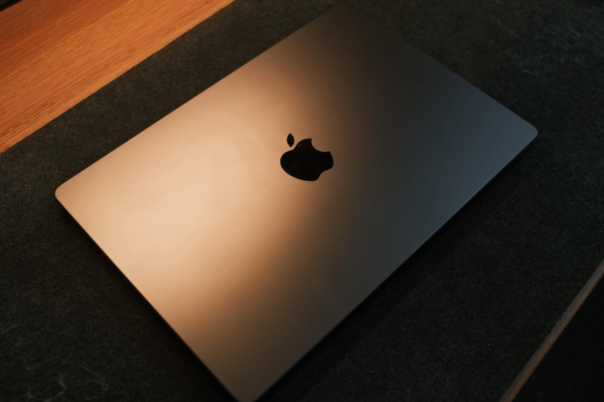
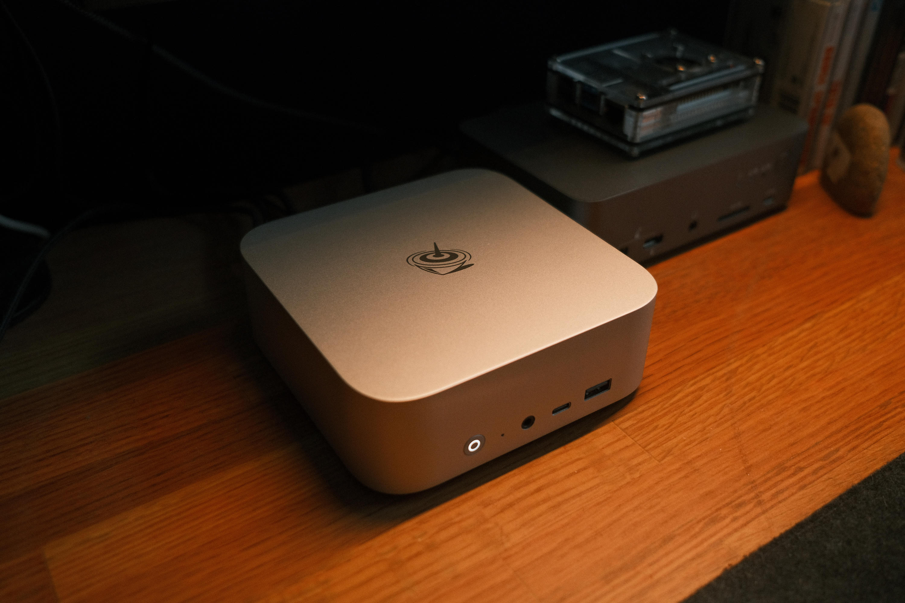
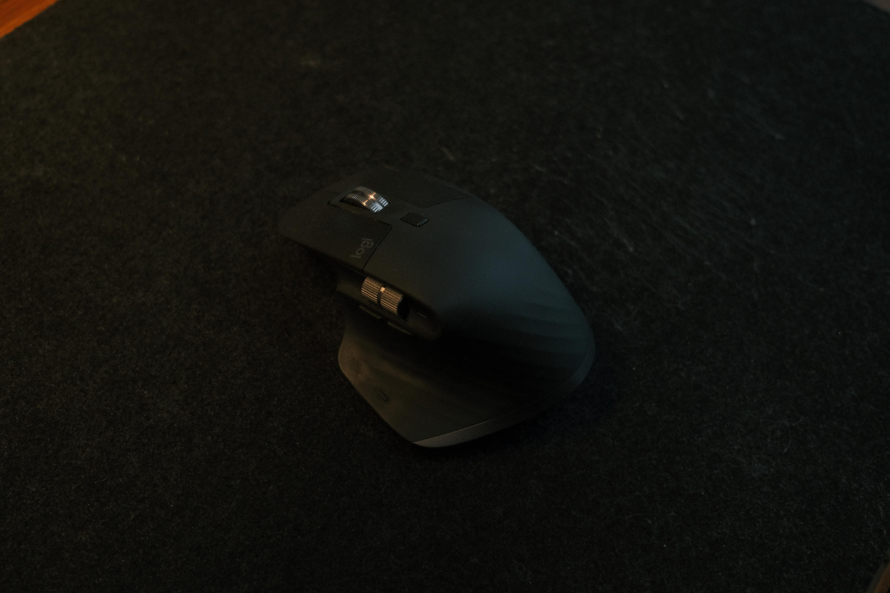
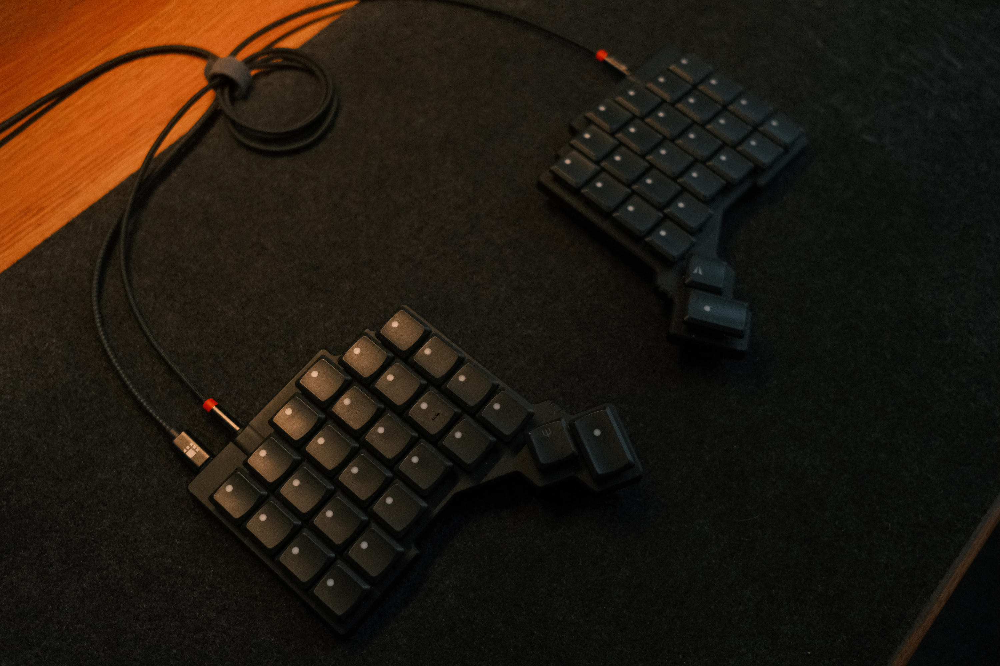
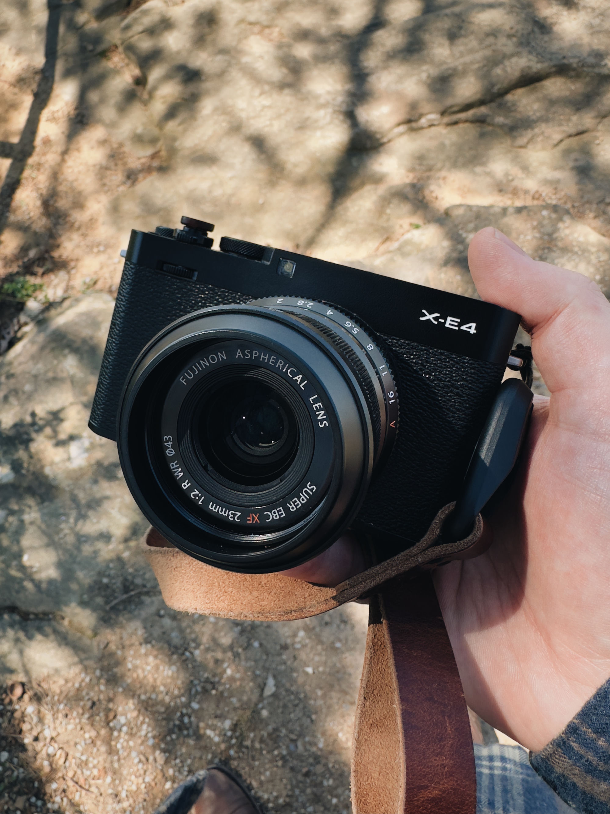
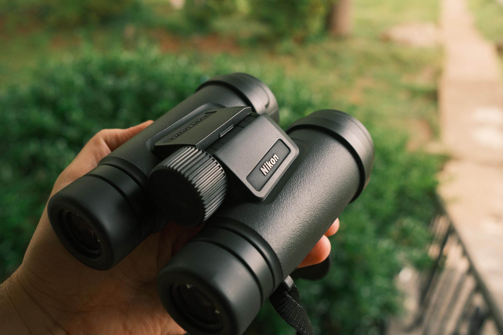
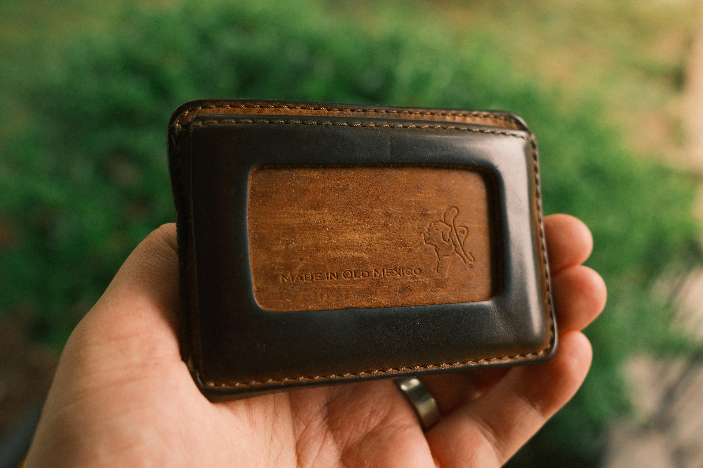
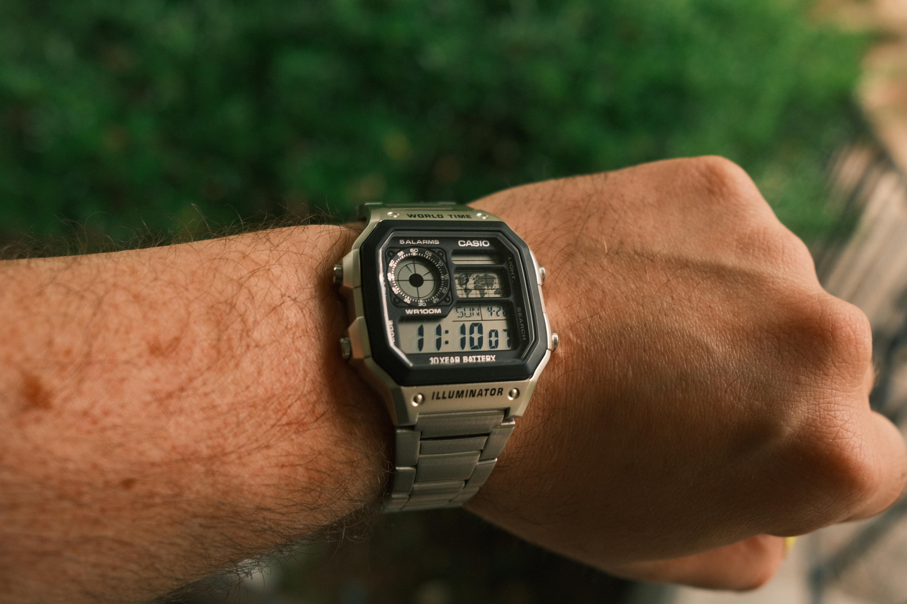
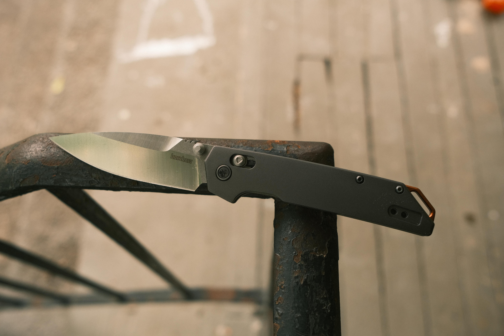
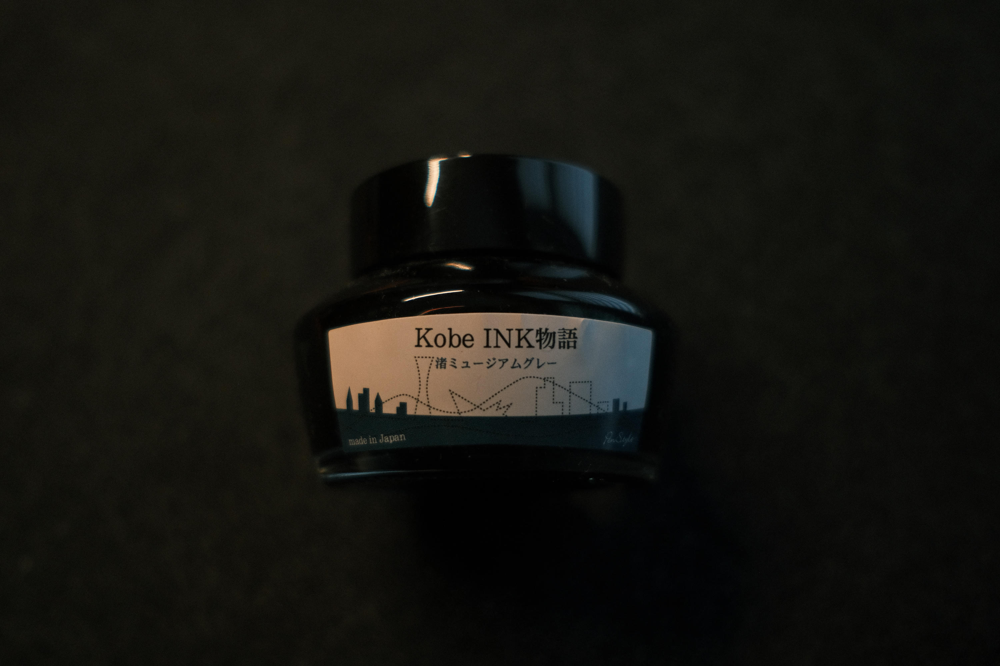

A non-comprehensive list of things I'm currently using.

## Hardware/Gear

### M4 Macbook Pro

Primary computer is a M4 Macbook Pro, and as much as I would love to go Linux full time, it's hard to justify getting rid of this thing. The performance and battery are just too good to pass up now, but I've been keeping my eye on Framework and their new Pro series.

### Beelink SER8

I also have a small Beelink SER8 (aka "Benson") that acts like my Linux desktop / home server, and it's an absolute champ. 1TB SSD, 32GB Ram, and since it's running Arch with zero desktop manager by default, the energy and CPU footprint is razor thin. Opening up `btop` makes you wonder if it's doing anything at all, but in reality it's running over 12 different apps over the web through Cloudflare tunnels. If at any point I need to use it as a desktop I just start up `mango` as my compositor and even then the memory and CPU footprint is minimal. I just love this thing.

### Logitech MX Master 3S

Daily use mouse is the MX Master 3s; can't go wrong.

### ZSA Voyager

I've done several custom keyboards over the years which is such a fun hobby, but unfortunately I had to switch to a split keyboard due to my wrists. At the time the need was pretty dire and I needed instant relief, so I went with the ZSA Voyager.

### FujiFilm XE4

Been doing photography for over a decade and in this stage of my life the FujiFilm XE4 fits my needs perfectly. The last thing I want to spend time doing is editing photos; I just don't have the time like I used to. The film simulations on this camera are so good I just shoot JPEGs and pull them straight out of the camera; no editing at all. If you want to see some samples check out my [photography site](https://steve.photo).

### Nikon Monarch M5 8x42

As I started getting into bird watching more I decided to invest in some binoculars, and the Nikon Monarch M5 8x42 are fantastic. Rugged, waterproof, and very decent optics for the price point. For those getting into bird watching I highly recommend getting a nice pair of binoculars, it really does kick the experience up a notch.

## Software

Here's a quick list of some of the primary software I use on a day to day basis.

| Application | Description |
|---|---|
| [Wezterm](https://wezterm.org/index.html) | Terminal Emulator |
| [Nushell](https://www.nushell.sh/) | Default shell (I know, I'm weird) |
| [Berkeley Mono](https://usgraphics.com/products/berkeley-mono) | Primary font choice |
| [Commitmono](https://commitmono.com/) | Secondary font choice (used in projects) |
| [Starship](https://starship.rs/) | Shell prompt |
| [Fling](https://github.com/bbkane/fling) | Dotfile management |
| [Neovim](https://neovim.io/) | Text editor |
| [Tmux](https://github.com/tmux/tmux) | Terminal multiplexer |
| [Sesh](https://github.com/joshmedeski/sesh) | Tmux session manager |
| [Yazi](https://github.com/sxyazi/yazi) | File browser |
| [btop](https://github.com/aristocratos/btop) | Resource monitor |
| [Lazygit](https://github.com/jesseduffield/lazygit) | Git TUI |
| [Gum](https://github.com/charmbracelet/gum) | Scripting utilities |
| [Mango](https://github.com/mangowm/mango) | Wayland Compositor / Window manager (Arch) |
| [Helium](https://helium.computer) | Web Browser |
| [Mullvad](https://mullvad.net) | VPN |
| [Macchina](https://github.com/Macchina-CLI/macchina) | System information frontend |
| [Docker](https://www.docker.com/) | Managing running apps on my home server |
| [Raycast](https://www.raycast.com/) | Launcher/clipboard manager/everything |
| [CleanShot X](https://cleanshot.com/) | Screenshot multitool |
| [Jotts](https://andromeda.build/apps/jotts) | Minimal markdown notepad |
| [Feeds](https://andromeda.build/apps/feeds) | RSS aggregator and reader |
| [Posts](https://andromeda.build/apps/posts) | Micro blogging |
| [Cellar](https://andromeda.build/apps/cellar) | Wine log |
| [Library](https://andromeda.build/apps/library) | Book log |
| [Bookmarks](https://andromeda.build/apps/bookmarks) | Link manager |
| [Sipp](https://andromeda.build/apps/sipp) | Code snippets |
| [Shrink](https://andromeda.build/apps/shrink) | Image resizing |
| [OG](https://andromeda.build/apps/og) | Opengraph Preview |

## EDC

I used to be way more into EDC (Everyday Carry) and collected quite a bit of gear, but over the years I've significantly slimmed down. The following list isn't comprehensive but covers the items I actually use on a day to day basis. 

### Wallet

My wallet is from Saddleback Leather Company, and their marketing punchline “they’ll want it when you’re dead” has so far been true. I’ve been daily carrying this wallet for over a decade and it’s still going strong. Just one of those pieces of gear that you never have to trade out and I love it. 

### Watches

I have a few watches on rotation ever since my Hamilton Khaki Field Mechanical stopped running (I have plans to fix it myself pending my next hobby adventure). The Vaer S5 Tactical Field in 40mm has been a solid and reliable watch, and it’s hard to beat the classic NATO strap. 

I’ve also been getting into Casio watches for the reliability and low cost. The AE1200 aka Casio Royale is probably going to be the one that sticks the most. I often have to travel for work into different time zones and I love the world time feature on this watch. 

### Knife

I have a long history with knife collecting, and as I started to have kids I began to sell more and more as I just wasn’t as interested or in most cases needed the extra cash. I am thankful for this Kershaw Iridium as it checks so many boxes for me, including the lock mechanism, D2 blade steel, titanium handles, overall an amazing deal for $60. 

### Pens

Old, true, and reliable. I absolutely love these little ballpoint pens. I have some capped and others that are knockback (clicker), and these pens just write. Smooth, minimal, even refillable! For my day to day writing these are my go to pens.

Every now and then I break out a fountain and write with that instead. Currently I'm using the Kaweco AL Sport in Anthracite with a fine nib. It's a fantastic little aluminum fountain pen that just feels high quality. My only gripe is that it uses cartridges/converters rather than having a builtin piston mechanism. One time the converter came out of the pen and got ink everywhere, so I might eventually upgrade to Kaweco's AL Piston. I also have a TWSBI Diamond 580ALR which I do love, but it's just a bit large for a pocket pen. 

My current ink of choice is Nagasawa Kobe in Museum Grey. It's absolutely lovely and writes so well.

### Notebook

I've been a Field Notes user for over a decade, and why I like them and the collecting factor, I started to really enjoy MD paper. Then I discovered the Traveler’s Journal system and I was hooked. I currently have a passport size with a single dot grid insert, but I've already gone through two of the basic blank inserts which are nice. Inside I have the Kraft pocket for keeping random notes or stickers. 

