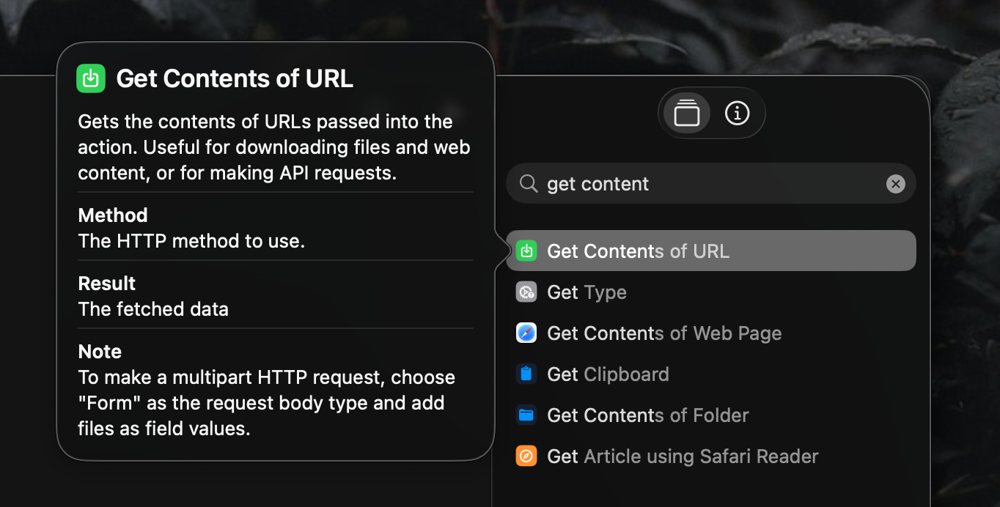

Something I discovered several years ago, that I'm now realizing may not be popular knowledge, is that iOS shortcuts has the ability to make API calls. The action is called `Get Contents of URL`. It's a bit deceiving because it sounds like it only does `GET` requests, but in reality it can also do `POST`, `PUT`, `PATCH`, `DELETE`, along with JSON, Form, or File request bodies, and headers! Combining this with existing iOS shortcut actions make it a pretty powerful tool, and it's something I use with my apps pretty regularly. Here's an example flow for adding a new RSS feed to my aggregator: 

1. Grabs input from the clipboard (this could also be a sharesheet, very handy for iOS)
2. Gets the RSS feeds for a given URL
3. Gets the name of the website 
4. Sends an API call to my aggregator with authorization headers and JSON body with the variables listed in 2 and 3
5. Shows the response of the API call

By using the Sharesheet input instead of clipboard I can easily click the Share button in any app then select "Add Feed" to subscribe via RSS; love it!

There are many other scripting tools inside the Shortcuts app that can be used to build more complex flows. While it doesn't support JSON parsing out of the box, the `Choose From List` can be used to filter through objects and arrays to narrow down selected pieces of data. Sometimes the Shortcuts action for getting an RSS feed doesn't work well, so I use my own built in endpoint to discover feeds on any given URL. 

This really is just the tip of the iceberg. Even while writing this post I found some other intriguing actions like running javascript, scripts over SSH, even generate QR codes! Would highly recommend exploring Shortcuts to anyone on iOS or MacOS. These little scripting tools are fun to play with and in a way help exercise our brains to do more problem solving.
