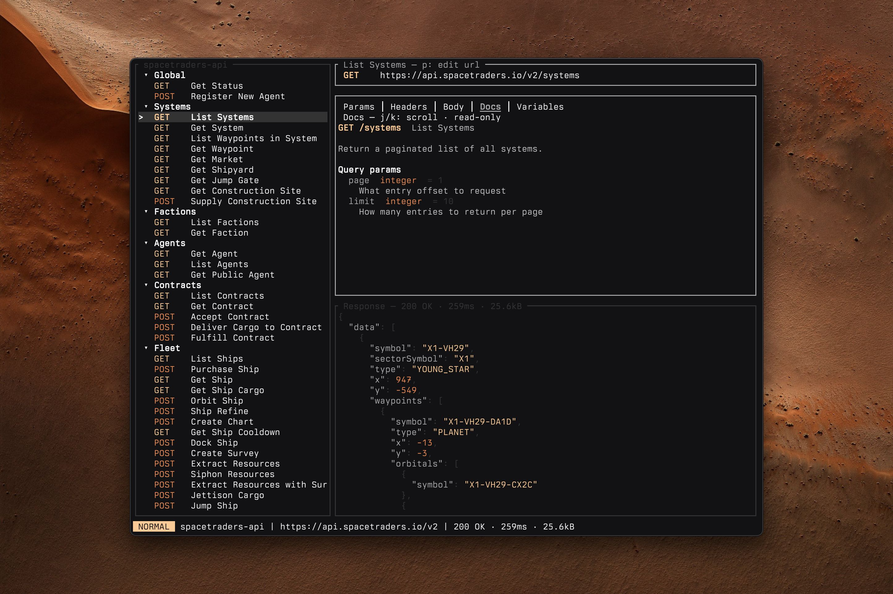

It was a regular Thursday at work. I tried to open Postman for the 3rd time in a row, and yet again everything froze and nothing would load.

"Fine then." 

That's how [Cielago](https://github.com/stevedylandev/cielago) was born. 

There are plenty of other tools out there for testing or interacting with APIs, however I had a few specific requirements. I needed something that could both import an OpenAPI spec and allow me to have multiple configurations, as well as OAuth support for authentication. That combo of the two proved to be pretty challenging to find, especially in TUI apps. With the requirements and vision in mind, I set up a detailed plan for LLMs to get started while I continued working. After building some TUIs in both Rust and Go recently, I decided to use Rust and Ratatui for this app. Both of the languages do well with LLM assisted coding, but I've found the Ratatui to be a superior framework for building terminal apps. 

To my surprise the MVP that came out of the LLM worked pretty well. It took some more tuning and guidance to get the polished app that I wanted, but after those changes I ended up with something I absolutely adore. Here's a quick rundown of features: 

- **OpenAPI 3.x import** — turn a spec (file or URL) into a collection with requests, params, example bodies, servers, and docs prefilled.
- **Ad-hoc collections** — no spec needed; paste a full URL and it's split into server, path, and query params for you.
- **Vim-style TUI** — three panes (requests / editor / response), `j`/`k` navigation, `:` command line, `/` incremental search.
- **Variables** — `{{name}}` from the collection, plus dynamic ones like `{{uuid}}`, `{{timestamp}}`, `{{randomInt(1,100)}}`.
- **Auth per collection** — a fixed bearer token, an API key in a header of your choice, or the OAuth2 client-credentials flow (tokens cached in memory only). Press `A` to configure.
- **Secrets from your shell** — any secret field (bearer token, API key, OAuth client secret) can be a `$(…)` command, resolved at send time, e.g. `$(op read "op://vault/item/field")`.
- **Server switcher** — swap base URLs so requests stay portable across envs.
- **Syntax highlighting** — JSON and XML in both request bodies and responses.
- **Plain JSON storage** — collections live in `~/.config/cielago/collections/`.

If you're interested and want to learn more, try installing it with `brew install stevedylandev/tap/cielago` or any of the other [installation methods](https://github.com/stevedylandev/cielago/releases). You can also check out the video overview linked below. 

  <iframe
    src="https://www.youtube.com/embed/Jv6O-_WH3N8"
    style="position: absolute; top: 0; left: 0; width: 100%; height: 100%;"
    frameborder="0"
    allowfullscreen
  ></iframe>

Cielago is [MIT open source software](https://git.stevedylan.dev/cielago).
