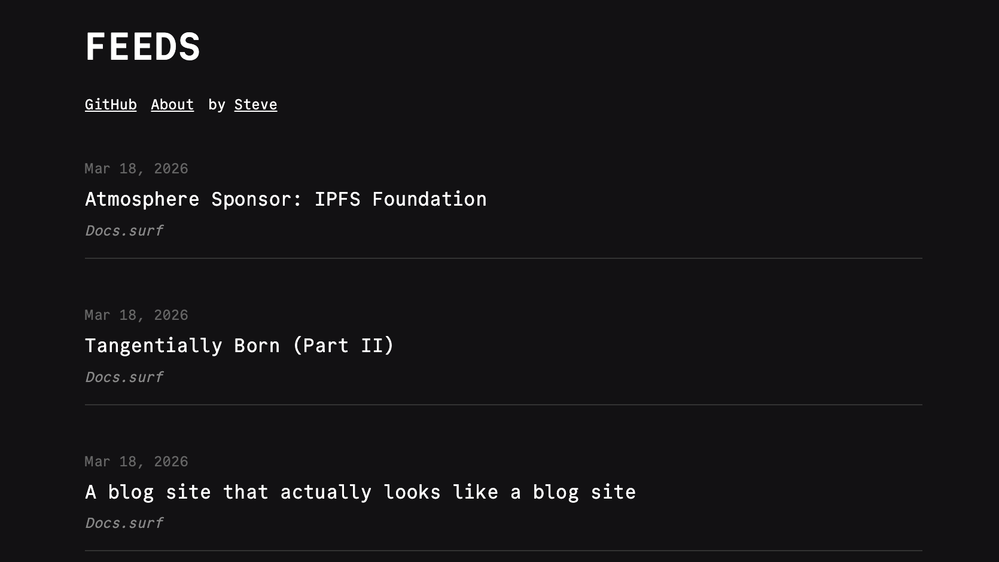
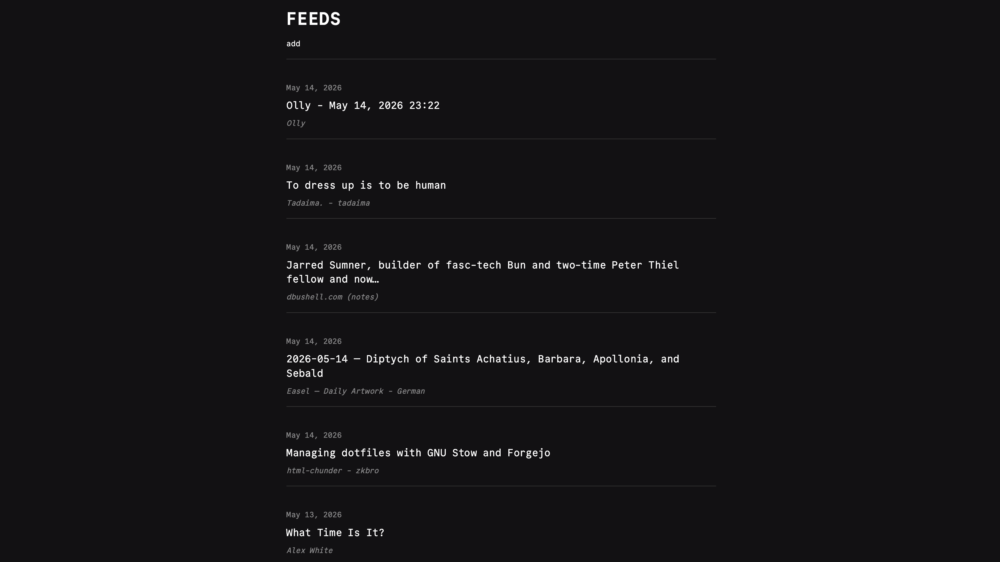
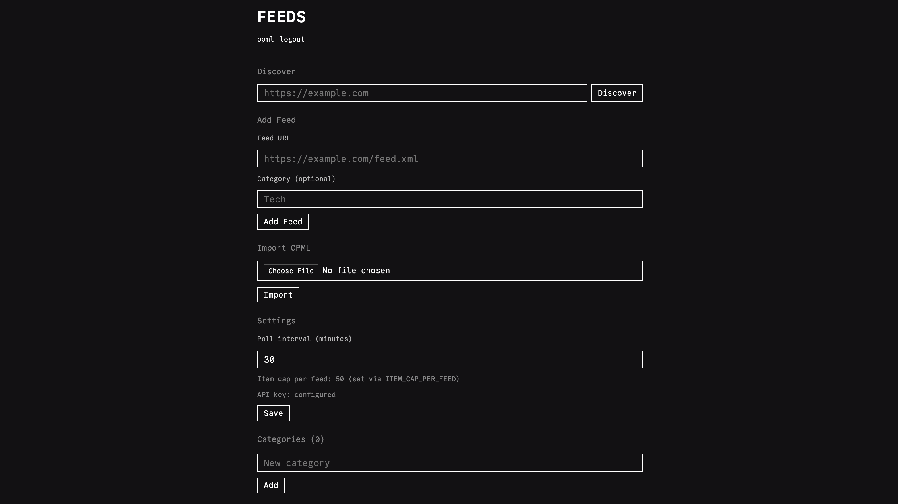
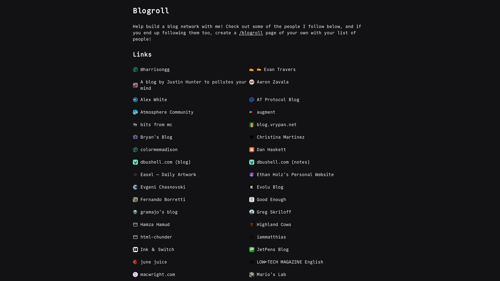
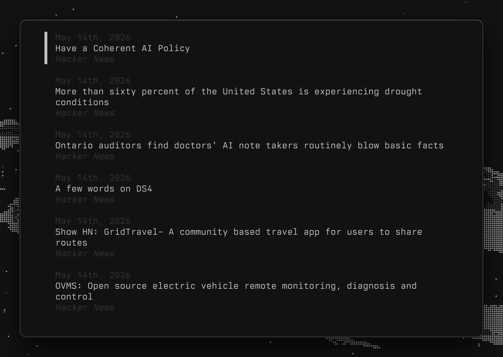

This post is about a little app called [Feeds](https://andromeda.build/apps/feeds), how it has evolved and fills all my RSS needs.

## The Reader

I've tried many RSS readers, but the one that stuck for a while was NetNewsWire. It has such a simple no nonsense approach to collecting and reading feeds. At the time I used it in combination with FreshRSS, and that combination worked pretty well. Ironically I built my first RSS client, [Alcove](/posts/introducing-alcove), as a response to a [blog post](https://inessential.com/2025/10/04/why-netnewswire-is-not-web-app.html) by the author of NetNewsWire. 

Even still, I found myself discontent with the approach of reading the content in the reader itself. Yes its convenient, but I was missing the experience of reading the post in it's original context. The majority of the feeds I follow are personal blogs, and I always appreciate the work people put into their personal sites. With that motivation, I made the first version of Feeds. This was a simple web app made with Bun that proxied a FreshRSS feed into a list of posts. No rendering, no read/unread marking, not even categories. I really, really, enjoyed this. That UX has stuck with Feeds as it has evolved. I later rewrote Feeds in Rust as part of [Andromeda](https://andromeda.build), but this piece of the reader experience has stayed exactly the same. 



## The Aggregator

As mentioned earlier I started out by using FreshRSS and self hosting it on my Linux desktop machine. This setup combined with a Cloudflare tunnel worked wonderfully; I could easily manage and access my feeds from any browser. While FreshRSS works great, it also had some downsides. It's an older PHP stack that takes up considerable more ram than I cared for, and it also had just so many features I didn't need. The truth is that FreshRSS can work as a single user setup, but it is certainly more geared toward multi user support with a host of features. Interacting with the APIs was also not intuitive or well documented, which was a problem for me since I had several use cases for this kind of access.

It wasn't until recently, while I looked through my running services on my home server, that I realized my Andromeda stack would be ideal for a minimal FreshRSS style aggregator. Web server, database, it's all handled. In no time at all, Feeds was adapted to be an aggregator that used SQLite and a regular cron job to update feeds. Since I wasn't having to store the content of the posts, it was incredibly efficient. I built an OPML import functionality, and soon my little Feeds app was showing posts independently of FreshRSS. Now I had an all in one RSS app, no need to proxy stuff, and an API that made way more sense.



The API comes in handy as I can easily share my followed feeds as JSON or an OPML file, and I can programmatically populate my [/blogroll](/blogroll).



## The Future

After building the aggregator functionality, there wasn't much else missing. I didn't need to build more features, maybe just refine a few things here and there. There was one thing I felt was missing, and that's a terminal view of my feeds. I ended up building a small TUI reader called [Bullets](https://github.com/stevedylandev/bullets) based on the original principle of Feeds. The primary difference is that Bullets is just a read only TUI, which I felt was missing from the space. I had no need to run another aggregator to fetch new posts or mark them as read. I just wanted to render what was already running in Feeds. The result was a beautiful ~300 lines of Rust that works like a dream. You just pass in a site or feed xml URL, and it does the rest.

```bash
bullets news.ycombinator.com
```



I've contemplated integrating Bullets into Feeds, but I'm still leaning towards leaving Bullets as a standalone reader that might help assist people who are not using Feeds. 

## Wrapping Up

Blogs and RSS have become my favorite way to consume and connect with other people online. Sure RSS is old, but it's such a simple protocol that makes it incredibly easy to make something like Feeds. While some people might groan at the thought of another RSS reader, I see it as people building what they actually want, and making it even more appealing for others to join the movement. In an age where social media is noisy and full of ads, RSS and blogs offer a haven of peace, connection, and meaning. Nothing excites me more to build tools like these to better connect with like minded people. All of the code for feeds is MIT open source and can be found [here](https://github.com/stevedylandev/andromeda/tree/main/apps/feeds) or via `ssh git.stevedylan.dev -t andromeda`.

With that said, I always want to connect with more people! Send me an email with the button below to introduce yourself so I can follow you via RSS, check out some of the people I'm already following on [/blogroll](/blogroll), and you can check out what I'm curating on [/feeds](/feeds). 

Keep writing
Keep reading
Keep the web open
