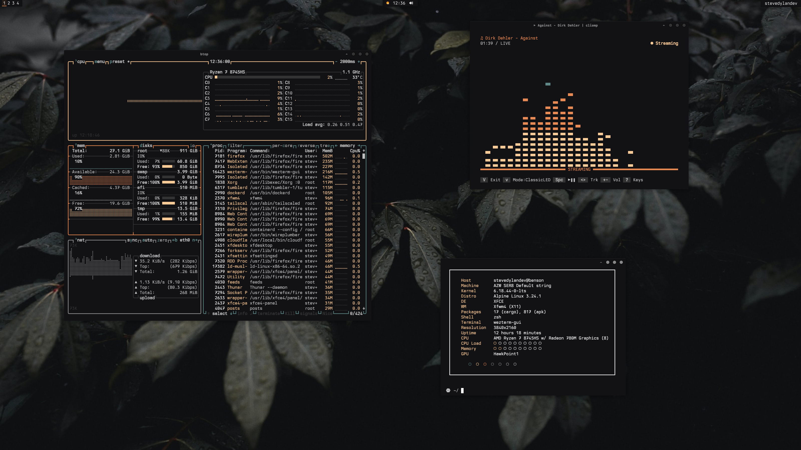

For a long time I enjoyed [Black Metal Bathory](https://github.com/metalelf0/base16-black-metal-scheme) as my primary theme, and I used it just about everywhere. Eventually I just couldn't deal with the `#000000` black background and wanted something more subtle. Out of this a new theme was born, which I called Darkmatter. Over time I built ports for all the apps I used, and shared a few as dedicated personal repos. I had enough people ask me for the theme that I decided it was time to create a formal [GitHub org](https://github.com/darkmattertheme) with a website that I could point others to. That site is now live, and I hope others who like the theme will help build it's legacy through contributing ports. Even if no one does, I like that I have all I need to support my own use of the theme. Check it out today! 

[darkmattertheme.com](https://darkmattertheme.com)
