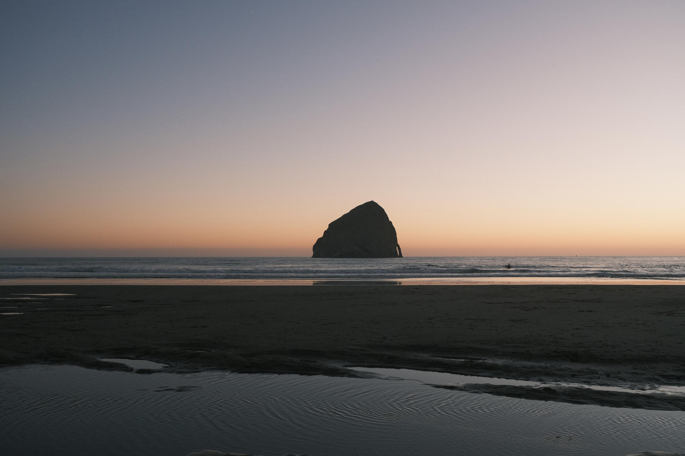
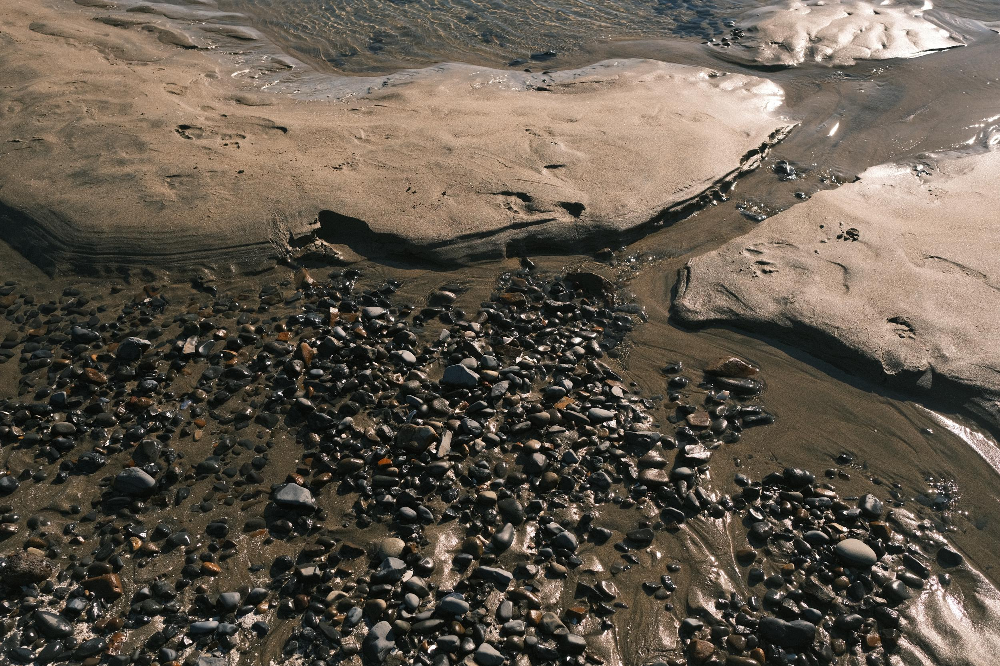
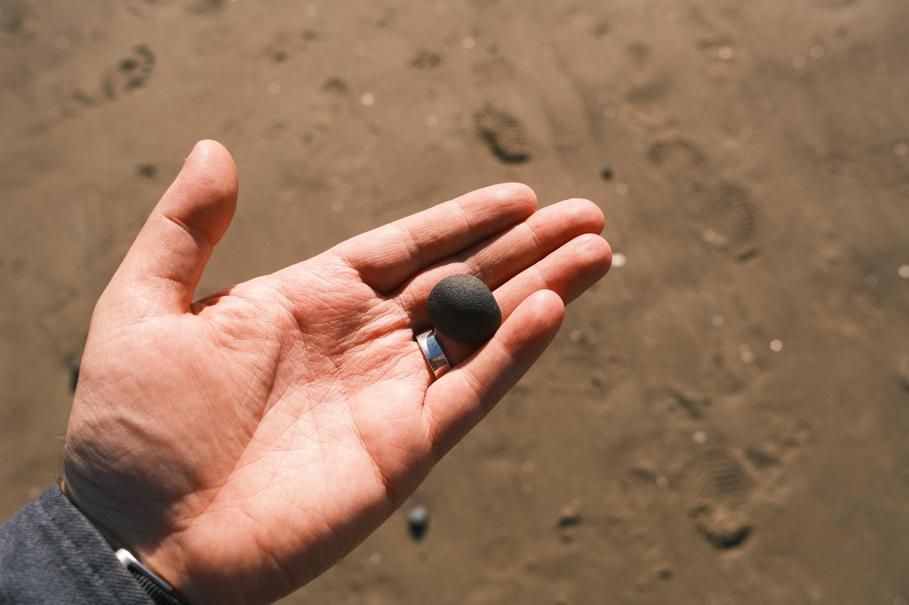

This past week my family and I visited the Oregon coast, spending time with our friends who live in the area. It was a beautiful sunny day and a mild 65F with a steady breeze. We specifically visited Cape Kiwanda which has a breathtaking view and sample of Oregon coast geology, including a haystack and a ridge made of sandstone. By the time we got there the tide was starting to go out, and soon there were small ridges in the sand with pools of water that my kids got to play in. The receding tide also revealed a host of small stones and seashells that had drifted into land. 

Looking at the vast collection of smooth rocks and pebbles, I thought this was a great time to find a souvenir. After looking for several minutes, I found one stone that stuck out to me in particular. It was smooth, but it also had a bit of a porous texture. The color was a shade of black, but in the light it caught colors of gold and brown too. Rolling the stone in my hand I admired the shape: a round top, flat base, with another slightly flat edge. 

I really enjoyed this rock, especially the color and texture. After tucking it into my pocket, I started looking around for rocks that might be similar. To my surprise, this was not an easy task. One rock might have had a similar color, but the texture wasn't quite the same. The size was also hard to replicate exactly. I gave up, content with the stone I found that would follow me home.

The next day I sat at my temporary desk, rolling the small black stone through my fingers, thinking about the journey this piece of earth had been through. I thought about where it might have come from; was it from another distant shore, or perhaps not too far away? How old it must be, what it might have looked like centuries ago, before the crashing and rolling waves formed its shape. What are the chances and circumstances that brought it before me on that beach, just for me to pick it up and bring it home? 

These thoughts tossed in my mind and soon I saw the resemblance of people to small stones. There are so many of us on this planet, yet it seems difficult to find two people exactly alike in shape, shade, and texture. Our turbulent histories have broken and formed us into new shapes, and it always seems like the longer we toss, the smoother we become. All of our circumstances and life events put us in the exact place and the exact moment where we should be, experiencing another memory shared with others on similar paths. Even on the days where I experience pain or frustration with someone else, I think about what turbulence they also must have experienced. 

We're all small stones on a great shore.

Making our way through life.

Becoming something new in the process. 

