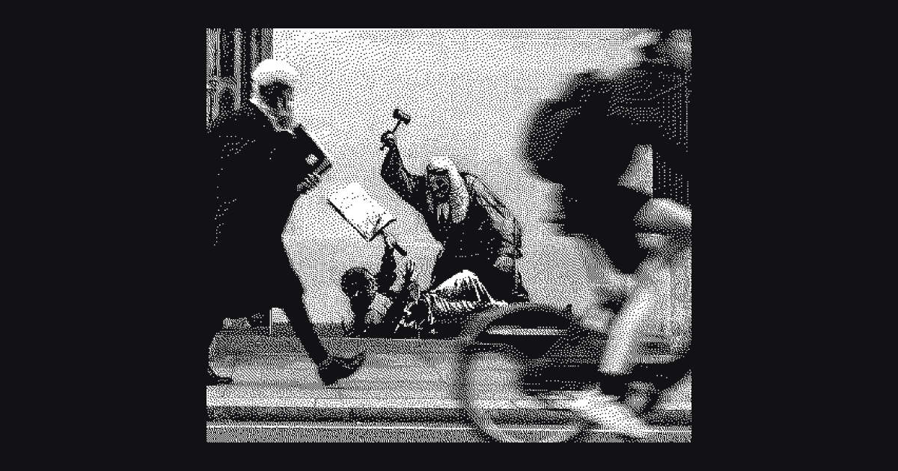

Earlier this week Daniel Roe wrote a blog post called ["Don't be nice."](https://roe.dev/blog/dont-be-nice) It's a short read so you should just take a glance at it, but the TL;DR is that someone joined the Nuxt community server with an avatar of a man wearing a Nazi uniform, and the offender was swiftly removed. The point of the post was that there are times when you shouldn't be nice when it comes to standing on your values of how people should be treated. As the closing line says, "Nice? It's better to be good." In the replies, a few people mentioned something called "The Paradox of Tolerance." It states[^1]:

> If we extend unlimited tolerance even to those who are intolerant, if we are not prepared to defend a tolerant society against the onslaught of the intolerant, then the tolerant will be destroyed, and tolerance with them. In this formulation, I do not imply, for instance, that we should always suppress the utterance of intolerant philosophies; as long as we can counter them by rational argument and keep them in check by public opinion, suppression would certainly be most unwise. But we should claim the right to suppress them if necessary even by force; for it may easily turn out that they are not prepared to meet us on the level of rational argument, but begin by denouncing all argument; they may forbid their followers to listen to rational argument, because it is deceptive, and teach them to answer arguments by the use of their fists or pistols. We should therefore claim, in the name of tolerance, the right not to tolerate the intolerant. We should claim that any movement preaching intolerance places itself outside the law and we should consider incitement to intolerance and persecution as criminal, in the same way as we should consider incitement to murder, or to kidnapping, or to the revival of the slave trade, as criminal.

Put more simply, "If a society extends tolerance to those who are intolerant, it risks enabling the eventual dominance of intolerance, thereby undermining the very principle of tolerance." I've seen this simplified even further to "don't tolerate the intolerant." A big part of me agreed with this line of thinking, especially the post by Daniel Roe. However, the more I thought about it, the more I found myself wondering if something was missing.

Most of the material I see on the paradox of tolerance is catchy graphics, but not much in terms of the philosophy itself. Karl Popper, the philosopher who formulated the paradox, held the virtue of rational argument in high regard. In order for an open and democratic society to exist, we must be able to have discussion and debate over ideas. For Popper, in order to justify suppression, the individual or group would have to abandon rational argument and choose violence instead. The mere mention of an intolerant philosophy was not enough to silence someone; on the contrary, suppression was to be held as the last resort.

This idea that the line to cross is violence or irrational intolerance was interesting to me, as it implies that someone has to define what is violent and what is irrational. For example, a cult that takes advantage of people could define opposition as violent or irrational rhetoric, and suppress what would otherwise be valid criticism. In a government or power structure, those in power can label dissent as intolerance and once again suppress people who might be fighting for moral virtue. It can also be said that the label "intolerant" can be wrongfully applied to minorities or people of color who are protesting and seen as extremist or divisive.

Others have also said that, in practice, the suppression of intolerant people does the opposite of stamping out bad ideology. If there is no rational argument to preface the suppression, then those who feel attacked simply go underground to find like-minded people who have also been cast out, thus growing a movement. My mind immediately goes to the story covered by the NYT called [Day X](https://www.nytimes.com/column/day-x), where the German military found itself plagued by far-right extremism and acts of terrorism.

All of this to say that I think there is a lot of nuance to this conversation that is being missed. I'm not saying we should tolerate the offender in Daniel's post, as I myself would have done the exact same thing. What I am saying is that we need to be people of complexity, of nuance, who think through these things on a case-by-case basis. Using "don't tolerate the intolerant" as a bumper sticker will leave you with a weak perspective, and in other cases you may find yourself being suppressed for the wrong reasons.

The other thing I think is missing from this conversation is interpersonal relationships. Our society is chronically online to a level that is unhealthy. We've lost the in-person friendships and acquaintances that made society work. The rational arguments that Popper so highly praised hardly work on the internet, but they are effective with people you know. Every extremist who ends up being intolerant of other people for bad reasons at some point didn't think that way. They arrived there. They listened to bad arguments, and perhaps found community when they couldn't find it anywhere else. What if they had a friend who knew they were starting to go down that path, but loved them all the same? Yes, there would still be hard conversations, but they end up being much more fruitful in the context of a good relationship.

This idea is not popular in our culture because it's hard. We naturally tend to like the people who think like us, and instead of finding common ground and having good discussions, we live behind our keyboards and yell into the echo chambers of our meaningless chats. I write this to urge you to do the hard thing, to love people who are hard to love, to think deeply, and to be nuanced. After all, that is what an open and democratic society is all about.

[^1]: Popper, Karl (2013) [1st Pub. 1945]. "Chapter 7, The Principle of Leadership, footnote 4". The Open Society and Its Enemies: New One-Volume Edition. Princeton University Press. p. 581.
