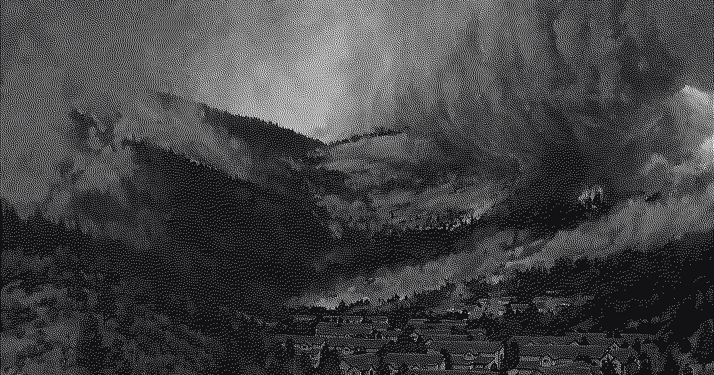

Earlier this year we made a plan to visit our friends in Portland, Oregon and do a camping trip at Crater Lake National Park. For months our family had been looking forward to it, especially my oldest son who is obsessed with volcanoes. This past weekend the day finally arrived. We crammed everything into the cars and started the long five hour drive to the park. In the last hour, as the road began to climb into the park, we started to notice a whole lot of haze in the sky. The smell revealed the culprit: smoke. Since there was no cell service we had no idea if this was a wildfire, a controlled burn, or any other details that would have informed us of what we were coming into. We pressed on and ascended the rim of Crater Lake and took in an astounding view. 

Driving a bit further we got to the campgrounds and set everything up. I got to use my new ham radio (listening only, license a work in progress) and listened to the closest weather station. We got the update that there was a wildfire about 60 miles away that was causing an air quality warning. It was slightly concerning, but we decided to wait it out a bit and make some dinner. Around 8pm, we found out from the camp store that there was a wildfire in the park, close to the road that would let us exit the park. We all discussed and made the hard decision to be cautious by packing up and leaving. My oldest son, who had been having the time of his life until that point, was utterly crushed by this news. He sobbed for over an hour, no matter how much we consoled him. Parents know that there are few things worse than watching your kids dreams fall apart, and the feeling that you can't do anything. We pivoted to a lake outside Sisters, Oregon, where our kids still got to go camping, jump in a lake, and watch the endless stars as they drifted off to sleep. Despite the good memories, this whole event left me thinking more about the glaring changes happening to our planet.

This summer has been rough. [People have been suffering](https://www.aljazeera.com/news/2026/6/29/more-than-1300-deaths-in-europe-amid-heatwave-what-can-countries-do) and in some cases dying from the heat waves across the globe. [Wildfires are reaching new highs](https://insideclimatenews.org/news/27032026/us-wildfires-already-setting-records-this-year/) in the US, and there have been [serious concerns about the approaching water crisis](https://www.sierraclub.org/sierra/can-colorado-river-survive-2026). Scientists point to global warming and our rapidly changing climate due to the [human bootprint of harmful emissions](https://www.worldweatherattribution.org/fossil-fuel-emissions-have-rapidly-worsened-european-heatwaves-in-just-a-few-decades/). After our camping evacuation, I thought about how this problem affected my son this weekend, and how it will affect him in the future as he inherits it from past generations. My mind races at the fear of what this planet will be like in 50 years, what survival looks like, and what other problems he and his family will face. My whole being hates this reality and the thought of leaving it like this. 

For a long time I've felt the urge to solve bigger problems and to make a difference. The domains have ranged from privacy, to censorship resistance, and more recently climate change. This has been heightened by having kids, knowing these problems will deeply affect their quality or chance of life and freedom in the future. Of course I can't solve these huge problems completely, but what if there's something I can do to help? In the busyness of life I sometimes have a little free time to work on side projects, and the question of what to work on constantly eats me away. Every now and then I contribute a little something like [Alcove](/posts/introducing-alcove/), but it never feels like it's enough to make an impact. 

In these thoughts that constantly occupy my mind, I have to stop and remind myself of my most important responsibility: my family. Yes in a way solving bits of these large problems would benefit them as well as humanity, but over-indexing them results in sacrificing my family in the process. The truth is that the most impact I can make is by being there for my wife and my kids. I am first and foremost a husband, a father. My family needs me to be present, to provide, to protect, to guide, and to love. The future lays in the hands of the next generation, and by equipping my kids with support, knowledge, wisdom, and love, they can go into the world and do greater things than I ever could. 

Perhaps I write all of this for myself, but also for those who might be struggling like me. You can still make a difference in the domains you are passionate about, but if you have to choose one, choose family. Your offspring will be the future of solutions, caring for others, and your time you budget now is how they succeed. Invest wisely, no matter how many wildfires your mind wants to put out.
