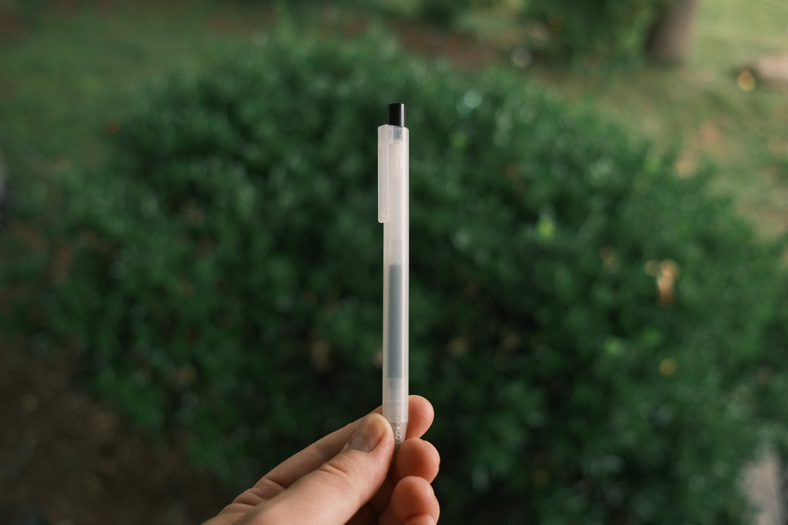

For the longest time I've had a weird obsession with stationery. I love finding and collecting pens, optimizing inks and paper, collecting a billion notebooks I'll never use, etc. Recently I got back into using and collecting fountain pens. I've kept a pocket notebook for over a decade, and I liked the idea of keeping a fountain pen on hand and using it regularly. Collecting and using different inks is so much fun, and one could argue way more economical than buying refillable pens. However, before getting back into this small hobby, I was daily driving a Muji Gel Ink Ballpoint Pen. My wife randomly picked up a few from a shop down the road from us, and I was immediately hooked. Even after transitioning to a more sustainable model with fountain pens, I kept thinking about those clear, minimal, and simple pens that just wrote so well. 

Muji set out in 1980 to sell quality goods at affordable prices, the name Mujirushi Ryohin literally meaning "No brand, quality goods." Since then it's grown into a massive success and ironically forming a look so distinct that it has become a brand in its own way. Their core design philosophy is refreshing: 

> MUJI’s vision of design is not about frills, seduction or the artificial renewal of collections, but rather a proposal to reduce appetites. Not in a spirit of frustration and restriction, but rather in peaceful moderation, aiming for modest satisfaction. Masaaki Kanai, faced with the (over)consumer society of the 80s governed by a tyrannical “This is what I want”, aspired to offer a soothing “This will do”.

After reading [their history](https://www.muji.eu/pages/about-muji.html) I decided to go back to that classic Muji pen, the phrase "this will do" ringing in my head over and over. I've always appreciated minimalism and have incorporated it into multiple places of my life. 

However, another side of me felt uncomfortable. I've always appreciated things that are well crafted, made with quality materials, and are simply beautiful. Naturally these kinds of items are more expensive, and it could be argued that they have counterparts that will do the same thing without the opulence. 

The more I pondered on this tug and pull between minimalism and opulence, the more I saw the harmony that comes with a perspective that sees the value in both. They are not exclusive ideas, and each has their own time and place. For example, if we go back to the fountain pen, it makes sense to use a nicer pen to write a meaningful letter or card to a loved one, while a cheap pen is great for jotting down a to-do list. A expensive watch handed down from my grandfather is better worn on a nice date, while my cheap Casio is great for mowing the lawn. 

In many of the examples I thought about, the one thing that struck of was how opulence was better spent in celebration or honor of others. What Muji set out to combat was consumption for consumption sake, and I believe similarly there is a lack of taste when things are made for opulence sake. It's much easier for me to justify a nice pen or watch for special occasions that will last a long time and I can hand down to my kids, rather than buying a designer couch that costs more than my car. 

In the end, I came to a place that helped me categorize the things in my life and reduce the pieces I really don't need, yet keep the things that are beautiful and meaningful. All thanks to a clear little pen in my pocket. 
